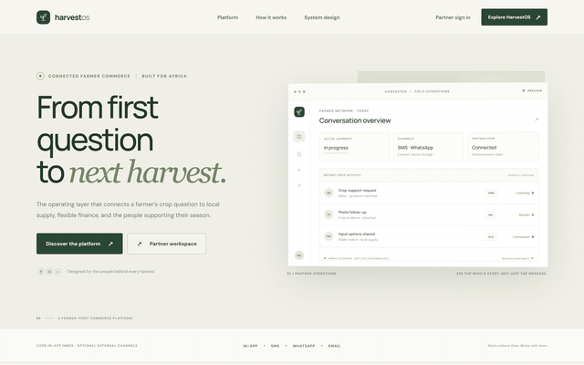
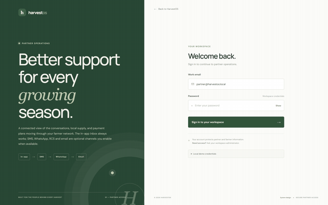
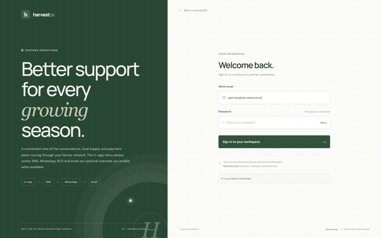
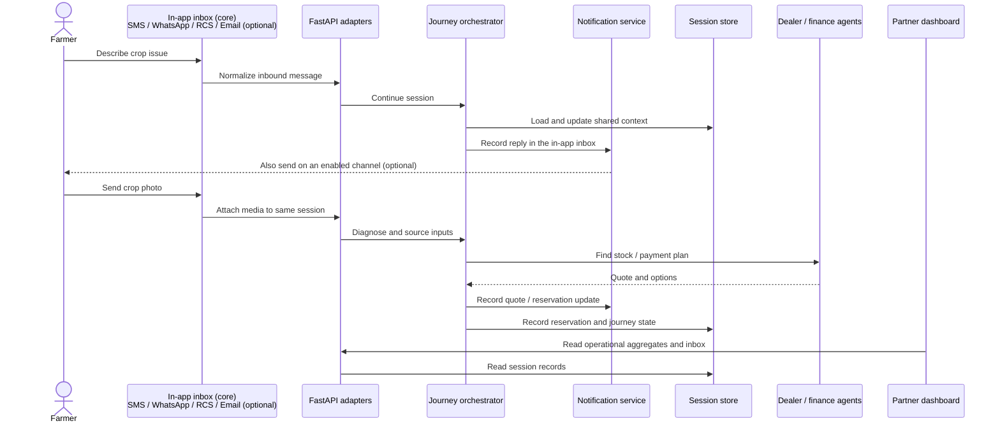

<p align="center">
  
</p>

<h1 align="center">HarvestOS</h1>

<p align="center">
  <a href="LICENSE"></a>
  <a href="package.json"></a>
  <a href="backend/pyproject.toml"></a>
  <a href="tsconfig.base.json"></a>
  <a href="infra/cdk"></a>
</p>

**A farmer's text should open a path to a harvest.** HarvestOS connects crop guidance, local agricultural supply, and financing in one continuous conversation. The core product runs on a durable **in-app notification inbox** and needs no external messaging service; SMS, WhatsApp, RCS, and email are optional adapters you enable when the matching AWS service is available.

Built for the AWS Communication Developer Services (CDS) Agentic AI Partner Hackathon. The repository contains a runnable local journey and an AWS infrastructure foundation. The core journey works without SMS, WhatsApp, SES, or S3 — external channels and cloud storage are optional and off by default. See [what works today](#implementation-status) before presenting a live integration as available.

## Landing page

The public site introduces HarvestOS and the farmer journey, from a first crop question to connected commerce. It explains how every update is captured in a durable in-app inbox, how SMS, WhatsApp, rich messaging, and email can be switched on as optional adapters, how local supply and financing are brought into reach, and how cooperatives and NGOs get a partner view of the work. Each section links through to the partner workspace so visitors can follow the story into the product.



## Partner sign-in and onboarding

Partner sign-in opens the operations console after authenticating with workspace credentials. The page explains what partners can do once inside: a connected view of the conversations, local supply, and payment plans moving through their farmer network. A successful sign-in issues a signed eight-hour HttpOnly session, so the operator lands directly on the dashboard Overview to begin triaging journeys.



## Authentication

Partners reach the sign-in screen at `/login` and authenticate with workspace credentials. The dashboard signs the session and issues a HttpOnly cookie that expires after eight hours, and the API verifies that signed session before serving dashboard endpoints in deployed mode. The local demo account is `partner@harvestos.local` / `HarvestDemo!2026`, rejected in production. Configure `HARVESTOS_AUTH_EMAIL`, `HARVESTOS_AUTH_PASSWORD`, and `HARVESTOS_SESSION_SECRET` in the dashboard hosting environment and use the same session secret for the backend; production must use a unique high-entropy secret, HTTPS, and rate limiting at the edge.



## Product tour

The partner overview consolidates live network metrics — farmers reached, messages handled, crop issues assessed, and input orders — alongside real-time conversation activity and an in-app notification inbox. A conversations table surfaces each farmer journey and its stage across channels, while the dealer network and impact & finance panels show input supply and financing supported by the connected sessions. Sample data is used throughout.

## The farmer journey



## Architecture

```text
In-app inbox (core)  +  SMS / WhatsApp / RCS / Email (optional adapters)
             │ notification service + channel adapters
             ▼
   FastAPI webhook + dashboard API
             │
             ▼
 Orchestrator ── Diagnosis / Commerce / Finance / Logistics
             │                    │
             ▼                    ▼
 Session store             Dealer and journey state
 memory locally             DynamoDB in AWS mode
             │            assets: local dir (default) / S3 (optional)
             ▼
 Next.js partner dashboard
```

The notification service always records every user-facing update in the in-app inbox and only attempts external delivery through providers that are explicitly enabled. The journey/orchestrator owns the next action; agent modules handle specialist decisions; the session store preserves channel continuity; the dashboard reads operational aggregates and the inbox. Full boundary, trust, and deployment notes are in [docs/architecture.md](docs/architecture.md) and [docs/system-design.md](docs/system-design.md).

## Repository layout

```text
HarvestOS/
├── .github/
│   └── workflows/             # CI (tests + lint) and staging deployment
├── backend/                   # FastAPI services
│   ├── app/
│   │   ├── agents/            # diagnosis, commerce, finance, logistics + orchestrator
│   │   ├── channels/          # optional SMS/RCS, WhatsApp, email adapters (disabled by default)
│   │   ├── notifications/     # core in-app inbox + optional notification providers
│   │   ├── storage/           # local (default) and optional S3 asset storage
│   │   ├── routers/           # webhook ingestion + dashboard + notifications API
│   │   ├── services/          # journey orchestration service
│   │   ├── shared/            # cross-agent types, channel policy, session store
│   │   ├── data/              # seeded dealer network
│   │   ├── auth.py            # dashboard session / bearer auth
│   │   ├── config.py          # environment-driven settings + validation
│   │   └── main.py            # FastAPI entrypoint
│   ├── tests/                 # pytest suite
│   ├── Dockerfile
│   └── pyproject.toml
├── docs/                      # architecture, system design, demo script
├── frontend/
│   ├── landing/               # public marketing site (Next.js)
│   └── dashboard/             # partner operations console (Next.js)
├── infra/
│   └── cdk/                   # AWS CDK: storage, compute, observability
├── package.json               # npm workspace manifest
├── tsconfig.base.json
├── LICENSE
└── README.md
```

## Implementation status

- **Runnable locally, no external services:** FastAPI, rule-based diagnosis/commerce/finance/logistics journey, in-memory session store, seeded dealer network, durable in-app notification inbox, local asset storage, Next.js landing page, and a password-protected partner dashboard with a same-origin API proxy. SMS, WhatsApp, RCS, email, and S3 are optional adapters that stay disabled by default.
- **Core independence:** the product boots and completes the full journey with `NOTIFICATION_PROVIDER=in_app`, `EMAIL_PROVIDER`/`SMS_PROVIDER`/`WHATSAPP_PROVIDER=disabled`, and `ASSET_STORAGE=local`. Enabling an optional provider without its configuration fails fast with a clear `ConfigError`.
- **AWS foundation:** CDK always provisions DynamoDB + KMS, Fargate + ALB, the CloudWatch dashboard, and the budget alarm. The S3 asset bucket and SES email identity are optional (off by default) and created only when `HARVESTOS_ENABLE_ASSET_BUCKET=true` / `HARVESTOS_ENABLE_EMAIL=true`.
- **Production auth boundary:** the partner console has a signed eight-hour HttpOnly session and the API verifies that session in deployed mode. This MVP login supports one configured partner account; multi-user identity, organization/tenant management, recovery, and Cognito federation remain future work. Production must use a unique high-entropy session secret shared by dashboard and API, HTTPS, and rate limiting at the edge.
- **Not complete as an end-to-end production integration:** Bedrock AgentCore traces, real channel provisioning/webhook signature verification, multi-tenant Cognito identity, async queue/DLQ workflow, payment provider callback verification, and production dashboard hosting.
- **Demo mode is not production:** seeded dealer inventory and local rule-based decisions are for repeatable development; no loan eligibility or agronomic recommendation here should be treated as regulated financial or authoritative agronomic advice.

## Quick start

Requirements: Node.js 20+, npm, Python 3.11+.

```bash
npm ci
python -m venv backend/.venv
# Windows PowerShell
backend/.venv/Scripts/Activate.ps1
pip install -r backend/requirements-dev.txt
```

Create local configuration (PowerShell):

```powershell
Copy-Item .env.example .env
```

Start the API in one terminal:

```bash
npm run backend:dev
```

Start the partner console in another:

```bash
npm run dashboard:dev
```

Open the public landing page at <http://localhost:3000>. Start the partner console with `npm run dashboard:dev`, then visit <http://localhost:3001/login>. The local demo account is `partner@harvestos.local` / `HarvestDemo!2026`; these development-only defaults are rejected in production. The authenticated dashboard reads through its same-origin proxy to the local API at <http://localhost:8000>.

Try the local journey (the SMS webhook is always available; the reply is recorded in the in-app inbox):

```bash
curl -X POST "http://localhost:8000/webhooks/sms?auth=change-me-random-string" \
  -H "Content-Type: application/json" \
  -d '{"body":"my maize leaves are turning yellow","from":"+2348012345678"}'
```

Read the in-app inbox the dashboard uses (development mode allows direct access):

```bash
curl "http://localhost:8000/api/notifications"
```

External channels are disabled by default, so nothing is sent over SMS, WhatsApp, or email. A memory session disappears when the API process restarts; local assets are written under `.harvestos-assets/` (git-ignored).

## Commands

| Command | Purpose |
| --- | --- |
| `npm run backend:dev` | Start FastAPI on port 8000 |
| `npm run dashboard:dev` | Start partner console on port 3001 |
| `npm run frontend:dev` | Start marketing site on port 3000 |
| `npm run typecheck` | Type-check the TypeScript workspaces |
| `npm run backend:test` | Run backend tests |
| `npm run infra:test` | Run CDK unit tests |
| `npm run infra:synth` | Synthesize the CDK template |

## Configuration and AWS

`.env.example` documents configuration names. Never commit `.env` or paste credentials into issues, logs, screenshots, or CI output. The core settings are `NOTIFICATION_PROVIDER=in_app`, `EMAIL_PROVIDER`/`SMS_PROVIDER`/`WHATSAPP_PROVIDER=disabled`, and `ASSET_STORAGE=local`; enabling an optional provider (for example `EMAIL_PROVIDER=ses`) requires its matching configuration (`SES_FROM_ADDRESS`, `ASSET_BUCKET`, `SMS_ORIGINATION_IDENTITY`, or `WHATSAPP_PHONE_NUMBER_ID`) and fails fast otherwise. Configure `HARVESTOS_AUTH_EMAIL`, `HARVESTOS_AUTH_PASSWORD`, and `HARVESTOS_SESSION_SECRET` in the dashboard hosting environment; use the same session secret for the backend. The backend uses `APP_ENV=prod` to require the signed bearer token on dashboard endpoints. In ECS, store the secret as a JSON Secrets Manager value with a `session_secret` key and configure `HARVESTOS_AUTH_SECRET_ARN`; the Next.js host must receive that same value through its secret store. The development fallback is intentionally not used when `NODE_ENV=production`.

Use short-lived credentials locally where possible and GitHub OIDC for deployments. Before AWS deployment, review the [implementation plan](implementation.md), CDK outputs, expected spend, account/region, and the current integration status. `npm run infra:deploy` creates billable cloud resources; it is intentionally not part of the default setup. The current ALB output is HTTP-only and stored data resources are retained on stack deletion, so add TLS before any real traffic and plan data cleanup explicitly. Static hosting for the landing page must set security headers at its CDN because Next static export cannot attach response headers.

The staging workflow is manual and uses GitHub Actions OIDC. Configure the `staging` GitHub environment with `AWS_STAGING_ROLE_ARN` and `AWS_REGION`; restrict the IAM role trust policy to this repository and environment. No production deployment workflow is configured.

## Contributing and security

Read [CONTRIBUTING.md](CONTRIBUTING.md), [CODE_OF_CONDUCT.md](CODE_OF_CONDUCT.md), and [SECURITY.md](SECURITY.md). HarvestOS is MIT licensed; see [LICENSE](LICENSE).

## Hackathon demo beats

1. Farmer asks for help; the message is normalized and the reply is recorded in the in-app inbox.
2. The orchestrator continues the session and requests crop evidence (on an enabled channel such as WhatsApp, when configured).
3. Diagnosis and dealer matching produce an input quote.
4. The farmer reserves or asks about financing; the journey records the outcome.
5. The partner console shows the same session, its stage, channel history, and the in-app notification inbox.

Use a verified test environment and clearly identify simulated steps. See [docs/demo-script.md](docs/demo-script.md) for the timed version.
