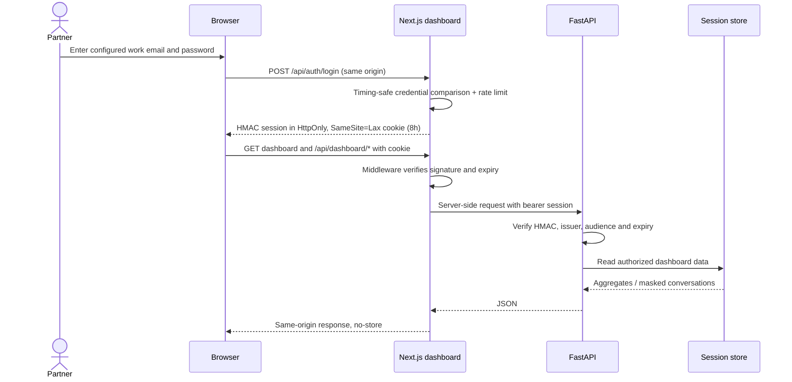

# HarvestOS system design

## Product surfaces

```mermaid
flowchart LR
  Visitor[Public visitor] -->|HTTPS| Landing[Static Next.js landing]
  Visitor -->|Partner sign in| Login[Dashboard sign-in]
  Login -->|Validate configured partner credentials| Auth[Next.js auth route]
  Auth -->|Signed 8h HttpOnly cookie| Browser[Partner browser]
  Browser -->|Cookie required| Middleware[Dashboard middleware]
  Middleware -->|Same-origin request| Proxy[Dashboard data proxy]
  Proxy -->|Bearer session token| API[FastAPI dashboard API]
  API -->|HMAC, issuer, audience, expiry| AuthCheck[Session verifier]
  AuthCheck --> Store[(Session store)]
  Store --> API
  API --> Proxy --> Browser
```



The landing page is a static, responsive product narrative. It links to the separately hosted dashboard. The dashboard is a server-rendered Next.js app with a sign-in route; its UI fetches private data through same-origin Next.js route handlers rather than calling the API from browser JavaScript.

## Sign-in and request sequence



Sign-out clears the session cookie. Login/logout POSTs require a matching `Origin` and `Host`. Unknown credentials use the same generic response. The login route applies a small per-process attempt window; production must also enforce durable rate limits at the edge because in-memory limits do not coordinate across instances.

## Auth configuration

| Variable | Dashboard | Backend | Purpose |
| --- | --- | --- | --- |
| `HARVESTOS_AUTH_EMAIL` | Required in production | — | The one configured partner account for this MVP |
| `HARVESTOS_AUTH_PASSWORD` | Required in production | — | Secret password supplied by the hosting secret store |
| `HARVESTOS_SESSION_SECRET` | Required in production | Required in production | Shared HMAC key; at least 32 characters of random secret material |
| `HARVESTOS_AUTH_SECRET_ARN` | — | Optional ECS wiring | Secrets Manager JSON secret ARN with a `session_secret` key |
| `HARVESTOS_API_URL` | Optional | — | Backend origin used only by the Next.js server proxy |

Development has a fixed demo account for local use. `NODE_ENV=production` disables all auth defaults and sign-in returns a configuration error until values are supplied. Never reuse the demo password or sample session secret in a deployment. The session key needs to be identical at both server runtimes; the ECS task reads it from Secrets Manager when the ARN is configured. Configure the dashboard host with the same secret through its secret store.

This credential model is an access boundary for a single trusted partner account, not a complete identity platform. Before onboarding multiple organizations, replace it with Cognito or an OIDC provider, map claims to partner tenants, and enforce per-tenant data ownership in every API query.

## Trust boundaries

- Browser JavaScript cannot read the signed cookie (`HttpOnly`). Dashboard data routes are same-origin and require a valid cookie.
- The FastAPI dashboard router independently checks the signed bearer token in deployed environments. Local `APP_ENV=dev` deliberately keeps direct API development convenient.
- Production secrets must be provided by the deployment secret manager. Never put credentials in `NEXT_PUBLIC_*`, source code, or CDK plaintext environment values.
- The ECS API currently sits behind an HTTP-only load balancer. Add HTTPS before transmitting partner credentials or session tokens outside local development.
- The public webhook routes are separate from dashboard authentication and still require provider signature verification, replay protection, and rate limiting before live use.
- Cookies use `Secure` in production, `HttpOnly`, `SameSite=Lax`, path `/`, and an eight-hour expiry. There is no password reset, invitation flow, MFA, account lockout store, tenant role system, or refresh token.

## Mobile and accessibility design

- Landing page navigation collapses to a keyboard-operable disclosure menu below tablet width.
- Feature summaries, channel handoffs, and architecture layers reflow into one column on narrow screens.
- Dashboard tables retain horizontal scrolling rather than truncating identity and journey columns.
- Sign-in uses semantic labels, native email/password inputs, autocomplete hints, visible status/error feedback, and an accessible password visibility control.
- Both experiences respect reduced-motion settings and avoid requiring color alone to understand journey state.

## Runtime and deploy topology

```text
Browser
 ├─ CDN/static host: frontend/landing (port 3000 locally)
 └─ HTTPS host: frontend/dashboard (port 3001 locally)
       ├─ /api/auth/*           sign in / sign out
       ├─ /api/dashboard/*      authenticated data proxy (stats, conversations,
       │                        dealers, loan-health, notifications)
       └─ FastAPI service       /api/* validates signed bearer in prod
             ├─ DynamoDB         persistent session state (AWS mode)
             ├─ in-app inbox     durable notifications (always available)
             ├─ local assets     .harvestos-assets/ (default)
             └─ optional adapters S3 asset bucket / SMS / WhatsApp / SES
```

The dashboard's notification endpoints (`GET /api/notifications`, `POST /api/notifications/{id}/read`, `POST /api/notifications/read-all`) proxy to the FastAPI notification service and back the console's in-app inbox and unread badge. The existing CDK stack deploys the API/storage foundation only; the S3 bucket and SES identity are optional and off by default. Landing and dashboard hosting remain independent deployments. The static landing host must set security headers at its CDN. The partner dashboard needs server runtime support for middleware and API routes; do not export it as a static site.
